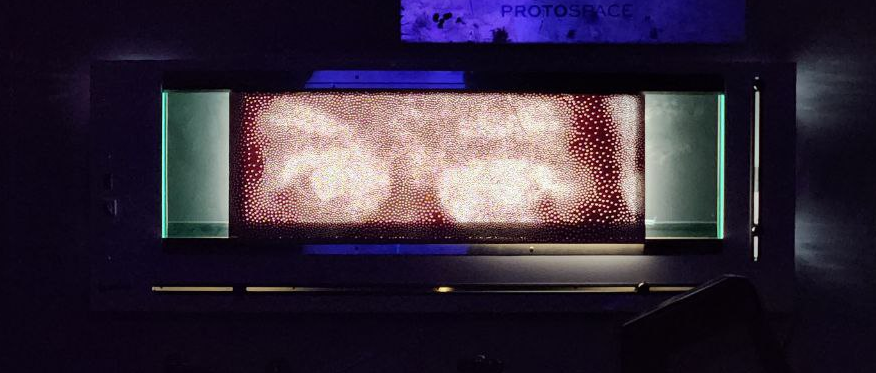
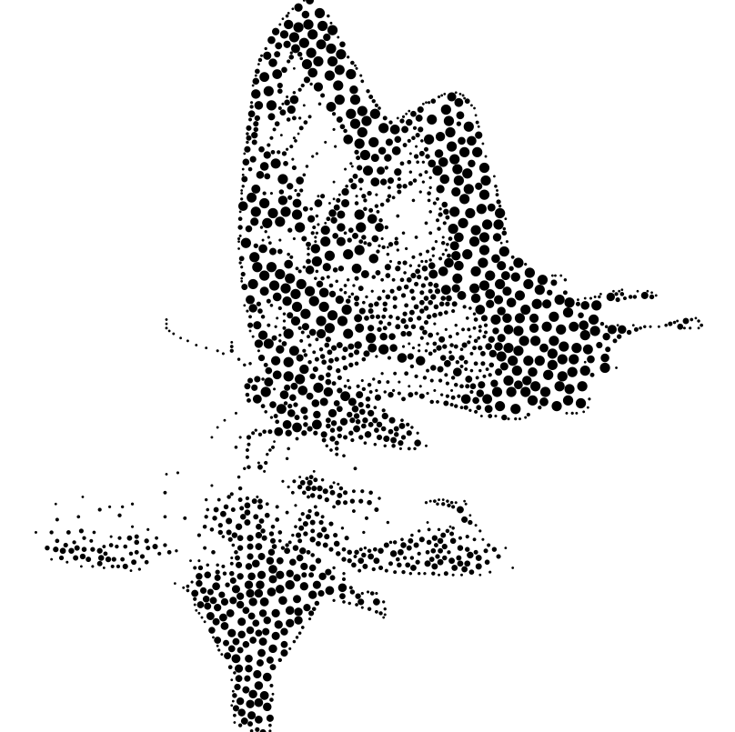
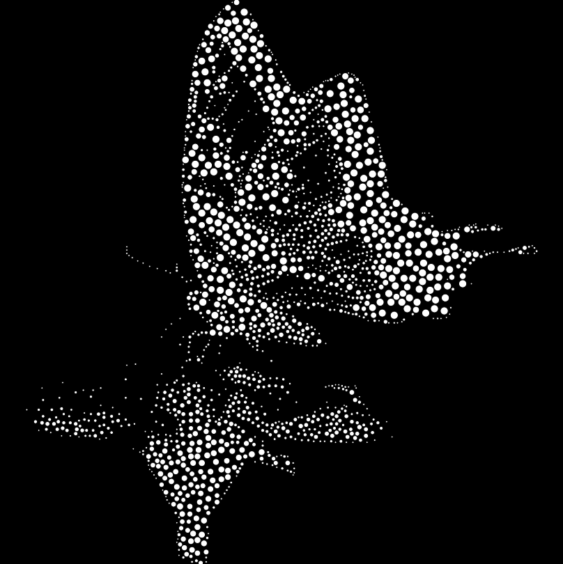
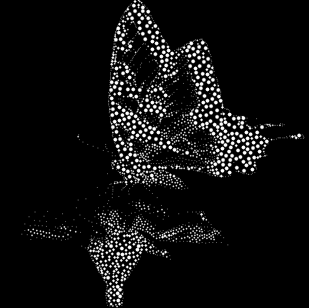
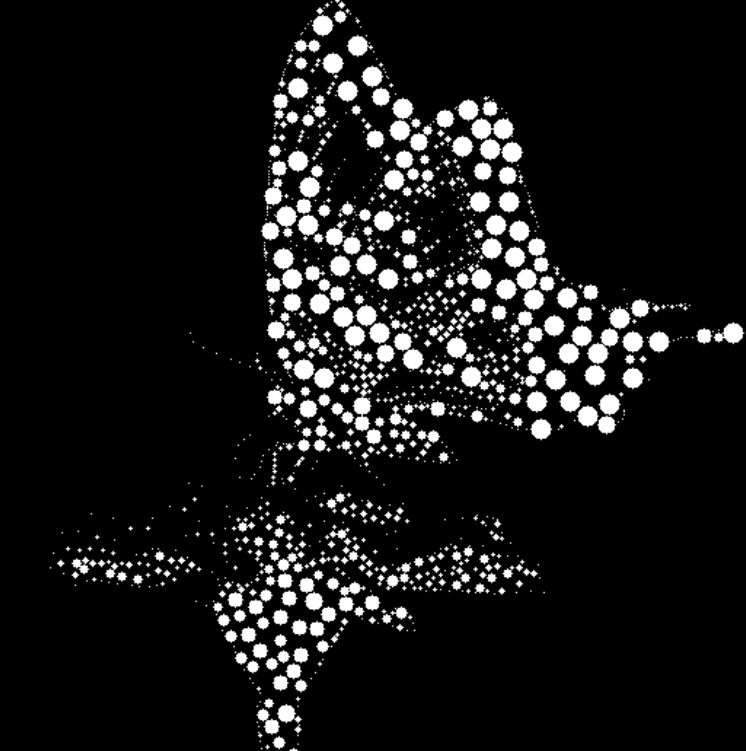
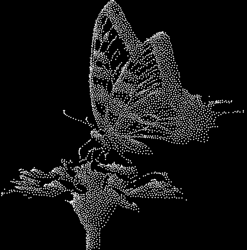
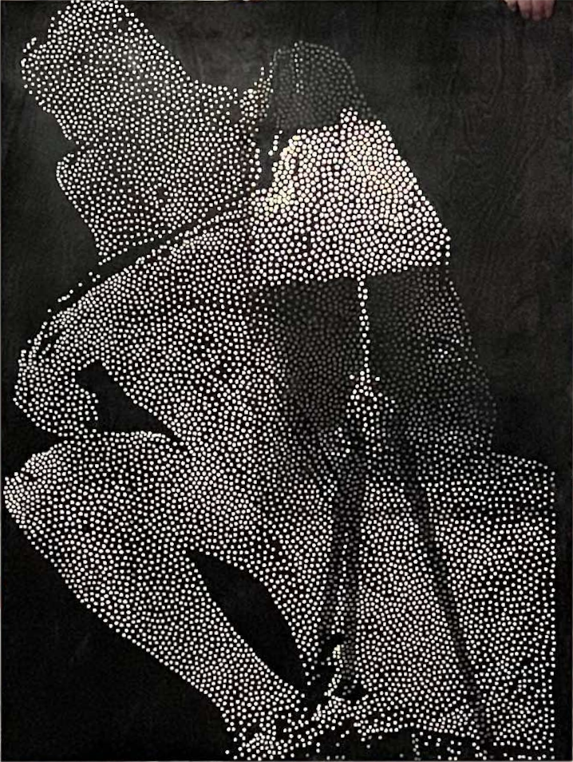

# Spattering

Weighted Voronoi stippling for grayscale images. Converts a single-channel image into a dot-based stipple pattern via **population-based iterative optimization** (relaxation as an evolutionary process: weighted centroid updates + fitness-based selection) and exports to **SVG for CNC tooling** — CNC cutting or laser engraving on wood and other materials.

<p align="center">
  
</p>

---

## Gallery: point radius range

Same source image (butterfly), different `pointUnitRadius` values — smaller radius gives finer detail, larger radius gives bolder dots.

| | | |
|:-:|:-:|:-:|
|  |  |  |
|  |  | |

---

## What it does

- **Input:** Grayscale image (dark = more dots, white = no dots).
- **Process:** A **genetic-algorithm-style** pipeline: initialize a population of point positions on dark pixels → run `relaxationIterations` generations of weighted centroid updates (Voronoi-based) → apply fitness-based selection (remove points on white). Dots concentrate in dark regions and thin out in light ones. See **[Genetic-algorithm view](#genetic-algorithm-view)** below for the full mapping.
- **Output:** SVG of circles; dot size and density are controllable. The SVG is intended for **CNC tooling**: import into your CAM or laser software and use it for CNC milling/drilling or laser engraving on wood, acrylic, etc.

Two generators:

1. **StandardStippleGenerator** — Intensity-weighted centroid relaxation (fast, uses a KD-tree). Each “generation” updates points toward the weighted centroid of their Voronoi cell.
2. **PreprocessingStippleGenerator** — Same evolutionary loop, with a precomputed flow field (angle/magnitude toward local darkest pixel) used in the update rule to bias movement and speed convergence.

---

## Genetic-algorithm view

The stippling pipeline is formulated as a **population-based evolutionary algorithm**:

| GA concept | In Spattering |
|------------|----------------|
| **Population** | The set of `numPoints` point positions in the image. Initialized at random on non-white pixels. |
| **Fitness** | Implicit: a point “fits” if it ends up in a dark or gray region (contributes to the stipple). Points on white are non-contributing. |
| **Update (mutation / recombination)** | Each generation, every point is moved toward the *weighted centroid* of its Voronoi cell — i.e. the center of mass of all pixels that are closer to that point than to any other, weighted by darkness (1 − intensity/255). So each individual’s new position is a deterministic function of the current partition and the image; the “environment” (image + neighbor structure) drives the update. |
| **Selection** | After the last generation, points that land on white pixels are **culled**. Only individuals that remain in non-white regions are kept. That is explicit fitness-based selection: remove low-fitness individuals. |
| **Generations** | `relaxationIterations` is the number of generations. Pipeline: *initialize population → for each generation: recompute Voronoi partition, update each point to its weighted centroid → select (drop points on white) → output*. |

There is no crossover between two points (no merging of two positions into one). The “recombination” is in the centroid update: each point’s next position aggregates all weighted pixel contributions in its cell. So the algorithm is a **steady-state evolutionary process**: population of points, repeated update from the environment (Voronoi + image weights), then one round of selection. Suited to optimization over a large, structured search space (placement of thousands of points) without gradient-based methods.

---

## CNC / laser tooling

The exported SVG is a set of circles (no fills, stroke-only) suitable for CNC and laser workflows:

- **CNC:** Use the circles as drill points or pocket paths; `pointUnitRadius` and `dpUnit` set dot size and scale so you can match your tool diameter and material units.
- **Laser:** Import the SVG into your laser software; each circle becomes an engrave path. Adjust radius and density in Spattering to match your laser spot size and desired detail.

Scale in the SVG is arbitrary (controlled by `dpUnit` and `pointUnitRadius`), so you can export once and rescale in CAM to your stock size.

---

## Requirements

- Python 3.x
- numpy
- opencv-python
- scipy

---

## Install

```bash
pip install -r requirements.txt
```

---

## Usage

Input must be a single-channel (grayscale) image. Load it with OpenCV and pass it to a generator.

### Standard generator

```python
import cv2
from src import StandardStippleGenerator, DebugOptions

image = cv2.imread("your_image.png", cv2.IMREAD_GRAYSCALE)
debug = DebugOptions("debug/", consoleDebug=True, visualizeDebug=True)

gen = StandardStippleGenerator(
    image=image,
    numPoints=10000,
    dpUnit=96,
    pointUnitRadius=1,
    relaxationIterations=100,
    debugOptions=debug,
)
gen.stipple()
gen.exportToSVG("output.svg")
```

### Preprocessing generator (flow-weighted)

```python
from src import PreprocessingStippleGenerator, DebugOptions

gen = PreprocessingStippleGenerator(
    image=image,
    numPoints=10000,
    dpUnit=96,
    pointUnitRadius=1,
    preprocessWindowSize=5,
    relaxationIterations=100,
    debugOptions=debug,
)
gen.stipple()
gen.exportToSVG("output.svg")
```

---

## Parameters

| Parameter | Meaning |
|-----------|--------|
| `image` | Grayscale OpenCV image (2D array). |
| `numPoints` | Target number of stipple points (only on non-white pixels for standard). |
| `dpUnit` | Dots-per-unit for SVG scale (e.g. 96 for screen). |
| `pointUnitRadius` | Circle radius in the same units; controls dot size in the SVG. |
| `relaxationIterations` | Number of relaxation steps (more = smoother, more uniform spacing in dark areas). |
| `preprocessWindowSize` | (Preprocessing only) Window size for local “darkest pixel” flow; larger = smoother flow. |

---

## Debug options

`DebugOptions(debugDir, consoleDebug=False, txtDebug=False, visualizeDebug=False)`:

- **debugDir** — Directory for all debug outputs (created/cleared when the generator is built).
- **consoleDebug** — Print progress to the terminal.
- **txtDebug** — Append timestamps and messages to `Debug.txt` in `debugDir`.
- **visualizeDebug** — Write intermediate images and, for relaxation, an `iterations/` sequence and `relaxing.mp4`.

With `visualizeDebug=True` you get e.g. initial points, relaxed points, post-processed points, and overlays. Use these images to style the README (see Gallery and sections below).

---

## Project layout

```
Spattering/
  src/
    __init__.py              # PreprocessingStippleGenerator, StandardStippleGenerator, DebugOptions
    utils.py                 # Drawing, video, polygon centroid, etc.
    classes/
      AbstractStippleGenerator.py
      StandardStippleGenerator.py
      PreprocessingStippleGenerator.py
      DebugOptions.py
  requirements.txt
  LICENSE                    # GPL-3.0
```

---

## License

GNU General Public License v3.0. See [LICENSE](LICENSE).

<p align="center">
  
</p>
